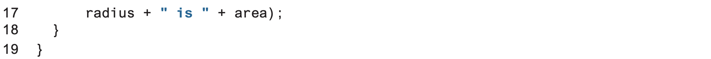
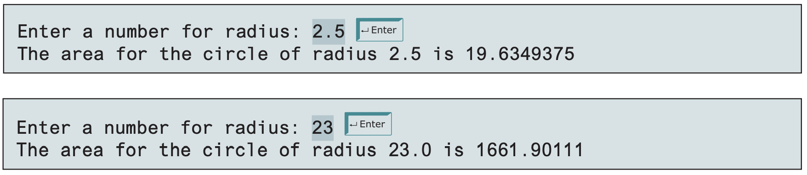

# Practical 01: Getting Started with Java

This practical will serve as a starting point to getting used to programming in Java.
However, all object-oriented programming concepts learnt in this module can also be applied into other object-oriented programming languages like C#, or other languages that have support for it like PHP.
Java is only considered a fully object-oriented programming language that's a good starting language to use to learn such concepts.

## Tasks

### Task 1

Create a program with a new class called `FirstJava` which produces the following output:

    This is my first attempt to
    program in Java
    It works!

Modify the source code such that it produces the following output:

    This is
    my first attempt
    to program
    in Java
    	It works!

### Task 2

Identify and fix the errors in the following source codes.

#### Program 1

```java
public class Practical1 {
	public static void main(String[] args) {
		System.out.println('Welcome to Java!);
	}
}
```

#### Program 2

```java
public class Test {
	public void main(string[] args) {
		double i = 50.0;
		double k = i + 50.0;
		double j = k + 1;

		System.out.println("j is " + j + " and
			k is " + k);
	}
}
```

### Task 3

Copy and run the following source code.




The expected output should be as follows:



Modify the source code such that it computes the circumference of a circle instead.

Formula:

    circumference = 2 * radius * pi

### Task 4

Write a Java program to calculate the area and perimeter of a rectangle when the user inputs the `width` and `height` using the following formula
(display the output in 2 decimal places):

    area = width * height

### Task 5

Write a program that displays the current GMT time in the format `hour:time:second` (e.g., `1:45:19`).

### Task 6

Write a program that converts pounds into kilograms.
The program should prompt the user to enter a number in pounds, convert it to kilograms and display the result.
Assume 1 pound is equal to 0.454 kilograms.

### Task 7

Write a program that converts MYR to USD.
The program should prompt the user to enter a double value in MYR, convert it to USD and display the result.
Look up online for the latest exchange rate and ensure the currency is displayed in 2 decimal places (as with most currency formats, this rule is a must).

### Task 8

Write a program that reads the subtotal and gratuity rate, then computes the gratuity and total.
For example, if the user enters 10 for subtotal and 15% for gratuity rate, the program displays $1.50 as gratuity and $11.50 as the total.
