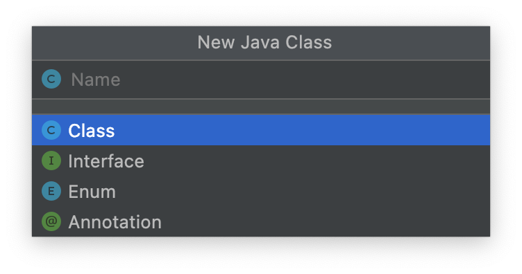
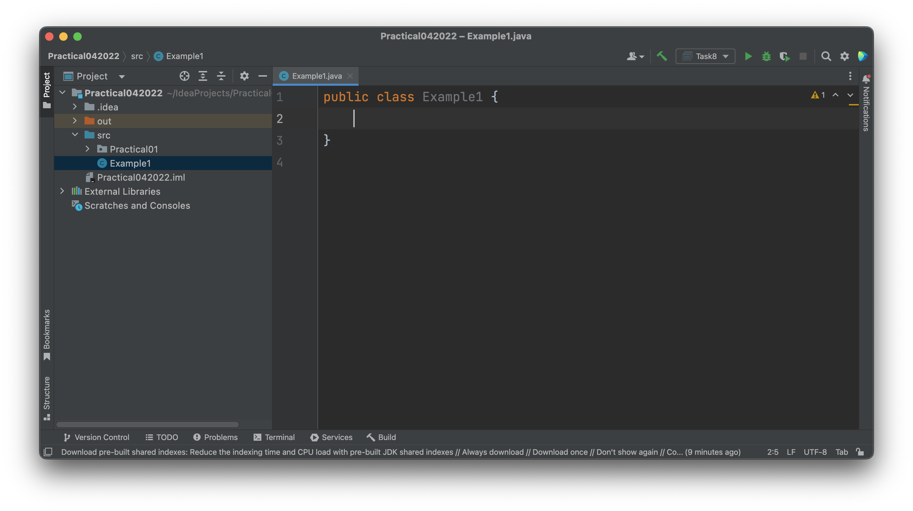
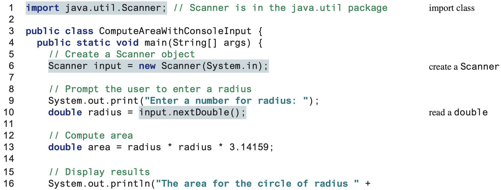

# Practical 01: Getting Started with Java

This practical will serve as a starting point to getting used to programming in Java.
However, all object-oriented programming concepts learnt in this module can also be applied into other object-oriented programming languages like C#, or other languages that have support for it like PHP.
Java is only considered a fully object-oriented programming language that's a good starting language to use to learn such concepts.

## Getting Started

### Creating Java files

To create a Java file, right-click on your `src` folder, and under `New >`, select `Java Class`.
Feel free to name your Java class in any way you wish, but ensure that **NO SPACES** are used inside them.

<figure markdown>

  <figcaption>New Java Class - Type in the name of your class here.</figcaption>
</figure>

We will revisit this when we learn about Interfaces in an upcoming session.

### Creating Packages

When creating your Java files, you can keep them directly within your `src` folder, or in packages.
To create a package in your project folder in IntelliJ Idea, simply right-click on your `src` folder, and under `New >`, select `Package`.
Name the package as you please, and it will now provide a separate folder that will act like a folder that is its own environment for all the Java files placed here.

### Main Method and Execution

Upon creating your Java file, whether directly inside your `src` folder or within a package itself, you should see something like this:



!!! tip "View for Java Files in Packages"

    If your Java file is located inside a package (in this example, `PackageNameHere`), there should be an extra line on top that says:

    ```java
    package PackageNameHere;
    ```

!!! danger "DO NOT CHANGE YOUR CLASS NAME!!"

    Keep the Java class name as is.
    The name of the Java class should always be the same as the name of your `.java` file – this means that if you have a `.java` file named `Exercise01`, the name of the class should also be `Exercise01`.

    ```java hl_lines="1" title="Exercise01.java"
    public class Exercise01 {

    }
    ```

    If you change it to something else, you will find that the program runs into some Errors during Building and Compilation of the project!

Your basic Java program will typically have a `main` method, from which your program will begin operations from.
The main method declaration is rather verbose, but each keyword used here has a meaning (more of which will make sense as upcoming lectures revolving methods and visibility are covered).

Declaring the main method should be like as follows:

```java hl_lines="2" title="Exercise01.java"
public class Exercise01 {
	public static void main(String[] args) {

	}
}
```

### Printing in Java

Printing in Java will require a line like as follows:

```java
System.out.println("Hello World!");
```

Take note that there are variations of the print statement, all of which you can use are as follows:

- `System.out.println()`: Prints everything inside the parentheses, and adds an additional new-space character (`\n`) automatically
- `System.out.print()`: Prints everything inside the parentheses without any additional characters appended to the back
- `System.out.printf()`: Prints everything with the same convention as a `printf()` statement from the C language, without any additional characters appended to the back

### Retrieving User Input in Java

Retrieving user input in Java will require use of the `Scanner` object.
You can declare a standard `Scanner` object at the beginning of the main method like as follows:

```java hl_lines="3" title="Example01.java"
public class Example01 {
	public static void main(String[] args) {
		Scanner input = new Scanner(System.in);

	}
}
```

Here, we name our `Scanner` object as `input`.
However you wish to name it is not set in stone, but given proper naming conventions, one should name all objects (and by extension, your class name as well) with the **Pascal Naming Convention**.

Notice that IntelliJ IDEA may include an import statement before your class declaration statement (if not, you should manually include this yourself):

```java hl_lines="1" title="Example01.java"
import java.util.Scanner;

public class Example01 {
	public static void main(String[] args) {
		Scanner input = new Scanner(System.in);

	}
}
```

Essentially, the `Scanner` library class should be imported in order to make use fo it in your program.
This will apply to many other library classes you may end up using when using many other different functions that are not baked into Java by default.

## Tasks

### Task 1

Create a program with a new class called `FirstJava` which produces the following output:

    This is my first attempt to
    program in Java
    It works!

Modify the source code such that it produces the following output:

    This is
    my first attempt
    to program
    in Java
    	It works!

### Task 2

Identify and fix the errors in the following source codes.

#### Program 1

```java linenums="1" title="Practical1.java"
public class Practical1 {
	public static void main(String[] args) {
		System.out.println('Welcome to Java!);
	}
}
```

#### Program 2

```java linenums="1" title="Test.java"
public class Test {
	public void main(string[] args) {
		double i = 50.0;
		double k = i + 50.0;
		double j = k + 1;

		System.out.println("j is " + j + " and
			k is " + k);
	}
}
```

### Task 3

Copy and run the following source code.




The expected output should be as follows:


Modify the source code such that it computes the circumference of a circle instead.

Formula:

    circumference = 2 * radius * pi

### Task 4

Write a Java program to calculate the area and perimeter of a rectangle when the user inputs the `width` and `height` using the following formula
(display the output in 2 decimal places):

    area = width * height

### Task 5

Write a program that displays the current GMT time in the format `hour:time:second` (e.g., `1:45:19`).

### Task 6

Write a program that converts pounds into kilograms.
The program should prompt the user to enter a number in pounds, convert it to kilograms and display the result.
Assume 1 pound is equal to 0.454 kilograms.

### Task 7

Write a program that converts MYR to USD.
The program should prompt the user to enter a double value in MYR, convert it to USD and display the result.
Look up online for the latest exchange rate and ensure the currency is displayed in 2 decimal places (as with most currency formats, this rule is a must).

### Task 8

Write a program that reads the subtotal and gratuity rate, then computes the gratuity and total.
For example, if the user enters 10 for subtotal and 15% for gratuity rate, the program displays $1.50 as gratuity and $11.50 as the total.
