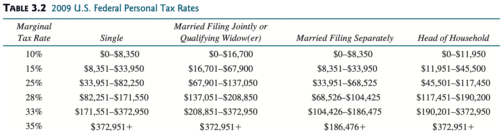

# Practical 02: Selection Statements

We will now proceed with implementing selection statements in this practical.
Selection statements in Java include the `if-else` statement and the `switch` statement.

## Activity: Shortening `if` Statements

Let's have a look at the following code snippet:

```java linenums="1"
int marks = 85;

if (marks < 0 || marks > 100) {
    System.out.println("Invalid marks value!");
} else if (marks >= 0 && marks <= 39) {
    System.out.println("Grade: F");
} else if (marks >= 40 && marks <= 43) {
    System.out.println("Grade: D-");
} else if (marks >= 44 && marks <= 46) {
    System.out.println("Grade: D");
} else if (marks >= 47 && marks <= 49) {
    System.out.println("Grade: D+");
} else if (marks >= 50 && marks <= 54) {
    System.out.println("Grade: C");
} else if (marks >= 55 && marks <= 59) {
    System.out.println("Grade: C+");
} else if (marks >= 60 && marks <= 64) {
    System.out.println("Grade: B-");
} else if (marks >= 65 && marks <= 69) {
    System.out.println("Grade: B");
} else if (marks >= 70 && marks <= 74) {
    System.out.println("Grade: B+");
} else if (marks >= 75 && marks <= 79) {
    System.out.println("Grade: A-");
} else if (marks >= 80 && marks <= 100) {
    System.out.println("Grade: A");
}
```

_**NOTE:** This nested `if` statement structure is based on the grading scale in Taylor's College._

Recall that the contents inside the `if` statement block is carried out **ONLY** if the given condition is fulfilled/is TRUE.

The first `if` statement in here restricts the kind of marks that can be assigned a grade value (i.e., marks that can receive a grade must be between 0 and 100).
This means that if the program proceeds to look at the consequent `if` statements, you can be sure that `marks` is in between 0 and 100, and not out of that given boundary.

The first `else if` statement checks to see if the `marks` is between 0 and 39.
One thing here is that we already know `marks` is already going to be between 0 and 100.. **emphasis on the 0 part**.
Since that part of the compound condition in this `else if` statement is always true, we do not need to check for if it is true or not.
We can now shorten the condition to be like as follows:

```java linenums="1" hl_lines="5"
int marks = 85;

if (marks < 0 || marks > 100) {
    System.out.println("Invalid marks value!");
} else if (marks <= 39) {
    System.out.println("Grade: F");
} else if (marks >= 40 && marks <= 43) {
    System.out.println("Grade: D-");
} else if (marks >= 44 && marks <= 46) {
    System.out.println("Grade: D");
} else if (marks >= 47 && marks <= 49) {
    System.out.println("Grade: D+");
} else if (marks >= 50 && marks <= 54) {
    System.out.println("Grade: C");
} else if (marks >= 55 && marks <= 59) {
    System.out.println("Grade: C+");
} else if (marks >= 60 && marks <= 64) {
    System.out.println("Grade: B-");
} else if (marks >= 65 && marks <= 69) {
    System.out.println("Grade: B");
} else if (marks >= 70 && marks <= 74) {
    System.out.println("Grade: B+");
} else if (marks >= 75 && marks <= 79) {
    System.out.println("Grade: A-");
} else if (marks >= 80 && marks <= 100) {
    System.out.println("Grade: A");
}
```

If we apply this logic recursively to the other `else if` statements, we can get the following:

```java linenums="1" hl_lines="5 7 9 11 13 15 17 19 21 23 25"
int marks = 85;

if (marks < 0 || marks > 100) {
    System.out.println("Invalid marks value!");
} else if (marks <= 39) {
    System.out.println("Grade: F");
} else if (marks <= 43) {
    System.out.println("Grade: D-");
} else if (marks <= 46) {
    System.out.println("Grade: D");
} else if (marks <= 49) {
    System.out.println("Grade: D+");
} else if (marks <= 54) {
    System.out.println("Grade: C");
} else if (marks <= 59) {
    System.out.println("Grade: C+");
} else if (marks <= 64) {
    System.out.println("Grade: B-");
} else if (marks <= 69) {
    System.out.println("Grade: B");
} else if (marks <= 74) {
    System.out.println("Grade: B+");
} else if (marks <= 79) {
    System.out.println("Grade: A-");
} else if (marks <= 100) {
    System.out.println("Grade: A");
}
```

Now pay attention to the last `else if` statement.
As per the first `if` statement again, if we proceed to look at the `else if` statements succeeding it, we already know that `marks` will always between 0 and 100.
This yet again means that we no longer require checking that condition at all.

Having said that, since this means the last `else if` statement no longer has a condition to check, we can replace it with just an `else` clause like as follows:

```java linenums="1" hl_lines="25-27"
int marks = 85;

if (marks < 0 || marks > 100) {
    System.out.println("Invalid marks value!");
} else if (marks <= 39) {
    System.out.println("Grade: F");
} else if (marks <= 43) {
    System.out.println("Grade: D-");
} else if (marks <= 46) {
    System.out.println("Grade: D");
} else if (marks <= 49) {
    System.out.println("Grade: D+");
} else if (marks <= 54) {
    System.out.println("Grade: C");
} else if (marks <= 59) {
    System.out.println("Grade: C+");
} else if (marks <= 64) {
    System.out.println("Grade: B-");
} else if (marks <= 69) {
    System.out.println("Grade: B");
} else if (marks <= 74) {
    System.out.println("Grade: B+");
} else if (marks <= 79) {
    System.out.println("Grade: A-");
} else {
    System.out.println("Grade: A");
}
```

And voila, we've just shortened out this nested `if` statement structure by reducing the number of conditions to check!

## Extra: Enhanced `switch` Statements (from JDK 17 and up)

From JDK 17 onwards, `switch` statements can take on an enhanced form akin to how lambda expressions (arrow functions) work.

### Traditional `switch` Statement

```java title="Traditional switch Statement"
switch (condition) {
    case 1:
        // do something
        break;

    case 2:
        // do something
        break;

    ...

    case n:
        // do something
        break;

    default:
        // do something
}
```

### Enhanced `switch` Statement

```java title="Enhanced switch Statement"
switch (condition) {
    case 1 -> {
        // do something
    }


    case 2 -> {
        // do something
    }

    ...

    case n -> {
        // do something
    }

    default -> {
        // do something
    }
}
```

<div class="text-center">
	<iframe class="youtube-iframe" src="https://www.youtube.com/embed/fkaYcm2tbj4" title="YouTube video player" frameborder="0" allow="accelerometer; autoplay; clipboard-write; encrypted-media; gyroscope; picture-in-picture" allowfullscreen></iframe>
</div>

## Tasks

### Task 1

Write a lottery program that randomly generates a two-digit number (10-99), prompts the user to enter another two-digit number (also 10-99), and determines what the user wins according to the following rules:

- If the user input exactly matches the randomly generated lottery number, the reward is $10,000.
- If the user input has both numbers used in the generated lottery number, the reward is $3,000.
- If any one of the digits in the user input matches one of the digits used in the generated lottery number, the reward is $1,000.
- Give no reward otherwise.

??? hint "Hint: Generating Random Numbers"

    One way to generate your random number is by using the `Random` library.
    To generate a random number between 0 to 99, for instance, you'll need to do the following:

    ``` java
    Random random = new Random();   // Step 1: Create new Random object
    random.nextInt(100)             // Step 2: Generate a random integer this way
    ```

    The reason why we put in 100 over here is because if you were to count from 0 to 99, you'll have had counted 100 integers in total.

    To shift the range, say between 10 to 109, focus on the lower bound (the lower number; i.e., 10).
    This is the number you'll have to add in order to get that exact range from which your random number will be selected from.

    ``` java
    random.nextInt(100) + 10
    ```

??? hint "Hint: The $3,000 Criteria"

    You will need to check each digit in the entered/generated integer individually to see if both integers are used.

    Use the division (`/`) and the modulo/remainder (`%`) operator to carry out this mechanism.

### Task 2

Write a program that prompts the user to enter a year and display the Chinese zodiac animal that corresponds with the given remainder after dividing by 12:

| Remainder | Chinese Zodiac Animal | Remainder | Chinese Zodiac Animal |
| :-------: | :-------------------: | :-------: | :-------------------: |
|     0     |        Monkey         |     6     |         Tiger         |
|     1     |        Rooster        |     7     |        Rabbit         |
|     2     |          Dog          |     8     |        Dragon         |
|     3     |          Pig          |     9     |         Snake         |
|     4     |          Rat          |    10     |         Horse         |
|     5     |          Ox           |    11     |         Sheep         |

??? hint

    Use the modulo/remainder operator (i.e., `%`) to determine the remainder from dividing the entered year by 12.

#### Extra Condition to Check

Negative values cannot be used to denote a year (there's the B.C. and A.D. shtick, but let's not dabble with that).

Check to see if the year entered is negative or not.

### Task 3

The Body Mass Index (BMI) is a measure of health on weight.
Create a BMI program that takes in both a person's weight and height as values to interpret the person's BMI.

The respective BMI interpretations are as follows:

|        BMI        | Interpretation |
| :---------------: | :------------: |
|    BMI < 18.5     |  Underweight   |
| 18.5 ≤ BMI < 25.0 |     Normal     |
| 25.0 ≤ BMI < 30.0 |   Overweight   |
|    BMI ≥ 30.0     |     Obese      |

The formula to calculate a person's BMI is as follows:

$$ \text{BMI} = \frac{\text{weight}}{\text{height} \times \text{height}} $$

where weight is measured in **kilograms (kg)** and height is measured in **meters (m)**.

### Task 4

The personal income tax is calculated based on the filing status and taxable income.
There are four filing statuses: single filers, married filing jointly, married filing separately, and head of household.
The tax rates are as shown below.



Create a program that prompts users to input their filing status and taxable income to calculate the required tax payment for the year.

### Task 5

Write a program to calculate the electricity bill with the **accumulative** rates as follows:

| Consumed Units | Rate ($) |
| :------------: | :------: |
|      1-50      |   1.15   |
|     51-100     |   2.60   |
|    101-150     |   3.55   |
|    151-200     |   4.50   |
|    201-300     |   5.90   |
|    301-400     |   6.90   |
|    401-500     |   7.90   |
|    501-1000    |   8.90   |
|     >1000      |  10.99   |

Sample Output:

    Enter Previous Month Reading: 180
    Enter Current Month Reading: 275
    Total Units Consumed: 95
    Total Bill: $174.50

??? hint "This actually requires a slightly complex calculation process."

    As the rates build up accumulatively, here's how one would calculate the bill amount for 95 consumed units:

    $$ \text{Total Bill Amount} = (50 \times 1.15) + ((95 - 50) \times 2.60) $$

    According to the given table, the first 50 units cost $1.15, the next 50 units cost $2.60, the following 50 units after that cost $3.55, and so on.

    In another case, say the next bill to issue is for 224 consumed units.
    The total bill will be calculated like as follows:

    $$ \text{Total Bill Amount} = (50 \times 1.15) + (50 \times 2.60) + (50 \times 3.55) + (50 \times 4.50) + ((224 - 200) \times 5.90) $$
