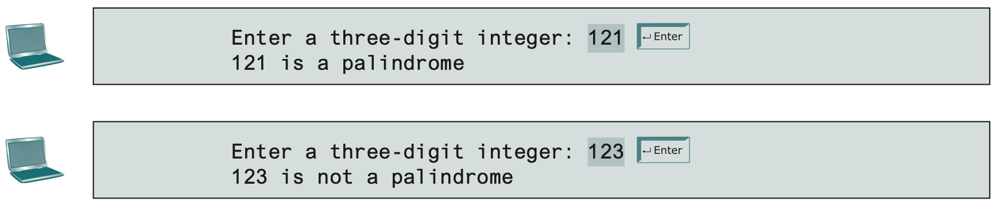

# Practical 03: Loop Statements

Loop structures make up the remaining part of program control structures.
We will be implementing loop structures (i.e., `for` loop, `while` loop, `do-while` loop) in this practical.

## Activity: `for` Loops vs. `while` Loops vs. `do-while` Loops

The following shows a for loop which iterates from 0 to 7, adding each iterated number into a variable called `sum`.

```java
int sum = 0;
for (int i = 0; i <= 7; i++) {
	sum = sum + i;
}
```

1. Add a line within the loop to print out the value of `sum` during each iteration.

2. Convert the given for loop into a while loop and do-while loop. Is there a difference in terms of output between these two loop types?

3. Convert the following for loop into a while loop and do-while loop. Is there a difference in terms of output between these two loop types?

```java
int sum = 0;
for (int i = 7; i < 7; i++) {
	sum = sum + i;
	System.out.println("Value of sum: " + sum);
}
```

## Tasks

### Task 1

Suppose that the tuition fees for a university program is $10,000 this year.
It is expected that the tuition fees increase by 7% per year.
Write a program that will estimate how long (in years) it will take for the tuition fees amount to be double of this year's amount.

### Task 2

Every day, a weather station receives 5 temperatures expressed in degrees Farenheit.
Write a program that will accept 5 Farenheit temperatures, and display the temperature expressed in Celsius on screen.
After 5 temperatures have been processed, output the message "All Temperatures Processed".

Conversion Formula:

    Celsius = (Farenheit - 32) * 5 / 9

Sample Output:

    Farenheit Temperature #1: 67
    67.00 degrees Farenheit is 19.44 degrees Celsius.

    Farenheit Temperature #2: 89
    89.00 degrees Farenheit is 31.67 degrees Celsius.

    Farenheit Temperature #3: 34
    34.00 degrees Farenheit is 1.11 degrees Celsius.

    Farenheit Temperature #2: 67
    67.00 degrees Farenheit is 19.44 degrees Celsius.

    Farenheit Temperature #5: 34
    34.00 degrees Farenheit is 1.11 degrees Celsius.

    All Temperatures Processed

???+ hint "Printing double Values in 2 Decimal Places"

    The simplest solution to do this is by using the `printf()` statement.

    ``` java
    // Example
    System.out.printf("%.2f degrees Farenheit is %.2f degrees Celsius.\n", farenheit, celsius);
    ```

    Another solution for more intricate display formats is by using the `DecimalFormat` library.

    ``` java
    /**
     * The last two zeros here forces the output to always be in 2 decimal places regardless
     * of whether it has fewer to begin with. (e.g., 2.5 -> 2.50)
     *
     * If you replace both of them with the '#' symbol, it makes it only so that the maximum
     * number of decimal places is 2. (e.g., 2.5 will still display as 2.5 and not 2.50)
     */
    String stringPattern = "#.00";
    DecimalFormat df = new DecimalFormat(stringPattern);	// declare new DecimalFormat object with stringPattern

    const double PI = 3.14159;
    System.out.println(df.format(PI));	// this prints 3.14
    ```

    With the `DecimalFormat` object, you can also place in a string pattern like `#,###.00` to make it such that a comma is printed to separate the thousands place from the hundreds place.

### Task 3

Write a program that prompts the user to enter a 3-digit integer and determines whether it is a palindrome integer.
An integer is a palindrome if it reads the same from right to left and left to right.
A negative integer is treated the same as a positive integer.

Here are sample runs of this program:



??? hint

    To check for 3-digit palindromes, the middle digit is of no significance.
    Check to see if the first digit and last digit are the same.

#### Challenge

Modify the program to check for 4-digit palindromes.

??? hint

    To check for 4-digit palindromes, every digit in the integer is now important.
    You will need to check 2 pairs of digits, one of which is still the first and last digits in the integer.

    What is the other pair?

### Task 4

Write a program that reads an integer between 0 and 1000 and adds all the digits in the integer.
For example, if an integer is 932, the sum of all digits is 14.

Sample output:

    Enter a number between 0 and 1000: 999
    The sum of digits is 27.

??? hint

    Use the `%` operator to extract digits and use the `/` operator to remove the extracted digit.
    For instance, `932 % 10 = 2` and `932 / 10 = 93`.

### Task 5

Construct a calculator program that takes in 2 integer values and performs one of the following mathematical operations by choice: addition, subtraction, multiplication, division, and modulo (the remainder function).

Include a **selection menu** to prompt the user to select the desired mathematical operation.

An example of how your selection menu can look like is as follows:

    =======================
    Calculator Program
    =======================

    	1. Addition
    	2. Subtraction
    	3. Multiplication
    	4. Division
    	5. Modulo/Remainder

    Select option (1 - 5) >>

#### Challenge

Modify your program so that it will keep asking for the mathematical operation followed by 2 integer values until a sentinel value of **-1** is entered during the option selection menu.

??? hint

    You'll need a loop structure to keep carrying out the process of asking for what operator and what 2 integer values.
    This loop structure should be based on whether the option value entered is -1 or not.

    How would you implement the option variable in your program in this case?

## Challenge Tasks

### Challenge Task 1

Write a program that displays the first 50 prime numbers in five lines, each of which contains 10 numbers.
An integer greater than 1 is prime if its only positive divisor is 1 or itself.
For example, 2, 3, 5 and 7 are prime numbers, but 4, 6, 8 and 9 are not.

??? hint

    - For each number (2, 3, 4, ...), determine whether a given number is prime.
    	The shortcut is to see if the current number is divsible by any number up to half its value.
    	Once a prime number is found, print out the prime number followed by a space.

    	```java
    	// ...
    	for (int divisor = 2; divisor < (iter / 2); divisor++) {	// shortcut is in here
    		// if current number in iteration is divisible by divisor that's not 1 or the same number as itself
    		if (iter % divisor == 0) {
    			isPrime = false;
    			break;
    		}
    	}
    	// ...
    	```

    - Have a counter value that counts up to 50 each time a prime number is found.
    	When the counter hits a multiple of 10, print a newline character.
    	When the counter value hits 50, stop the program.
