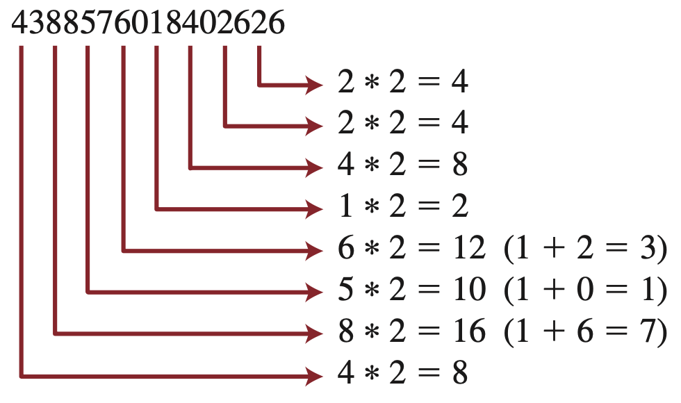
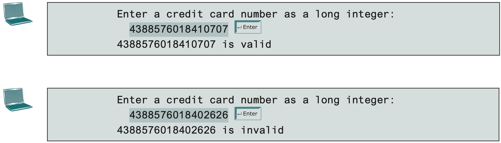

# Practical 05: Methods

Aside from being able to modularize code, using methods is integral to when we start covering Classes and Objects in the next session.
This practical introduces use of methods that will be used alongside the main method.

## Functions or Methods.. what gives!?

Methods and functions tend to be used interchangably (and in erroneous fashion a lot of the time); however, methods have a deeper meaning than functions.
Functions are used to carry out a process that changes input into output.
Whether these functions are useful in a certain context is dependent on when and/or where they are used.

Within the OOP context, these functions are sometimes called methods (or operations).
You can view methods as like **a way how objects do things**.
For example, the method a person speaks involves opening their mouth and letting out their voice.
Here, if you were to model a person as a class, this class would have a speaking function that's referred as a method.
In this case, unlike functions, methods are meant to have meaningful purposes.

!!! summary "Bottom Line"

    If a function can be attributed to an object, it's called a method.
    In fully object-oriented languages like in Java where everything is built in classes, all functions are called methods.
    More about classes and objects will be covered in the next lecture.

## Activity: Decomposing a Complex Program into Methods

Recall the simple calculator application you created in Practical 03 Task 6.
The prepared solution can be split into several methods carrying out different purposes.

1. Obtaining the option to choose the type of arithmetic operation to be carried out
2. Obtaining user input of two integer values
3. Displaying results from user inputs

Consider each of the following methods and determine what return type best fits the solution at hand.

### Method 1: Choosing Arithmetic Operation

The discussed solution involved obtaining an option with the use of a while loop like as follows:

```java linenums="1"
Scanner input = new Scanner(System.in);

int option = 0;
do {
   if (option == 0) {
      System.out.println("1.\tAddition");
      System.out.println("2.\tSubtraction");
      System.out.println("3.\tMultiplication");
      System.out.println("4.\tDivision");
      System.out.println("5.\tModulo (Remainder)");
   }
   System.out.print("Enter operation >> ");
   option = input.nextInt();

   if (option < 0 || option > 5)
      System.out.println("Invalid option, try again!\n");
} while (option < 0 || option > 5);
```

Let's encapsulate this part of the solution into a method called `selectOperation`.
The end result is the integer variable `option`.
Therefore, we use the `int` return type for the method.

At the end of this method, we ought to put in a return statement to return `option` back to the method that called it in the first place.
In this case, it would be the main method.

`selectOperation()` should look as follows:

```java linenums="1" hl_lines="2-3"
private static int selectOperation() {
   // this is going to cause a problem we'll solve later
   Scanner input = new Scanner(System.in);

   int option = 0;
   do {
      if (option == 0) {
         System.out.println("1.\tAddition");
         System.out.println("2.\tSubtraction");
         System.out.println("3.\tMultiplication");
         System.out.println("4.\tDivision");
         System.out.println("5.\tModulo (Remainder)");
      }
      System.out.print("Enter operation >> ");
      option = input.nextInt();

      if (option < 0 || option > 5)
         System.out.println("Invalid option, try again!\n");
   } while (option < 0 || option > 5);

   return option;
}
```

Notice that we also added the `private` and `static` keywords in front of the method declaration.
The use of the `private` keyword makes a method or variable such that it's only accessible within the class itself.
As for the `static` keyword, for the time being just know that you'll need to use `static` whenever you're linking methods in a class where a main method is involved.

In the `main` method, enter this in place of the code you just moved into the newly created method.
This will retrieve the returned value from the `selectOperation()` method and keep it in a local variable called `option`.

```java hl_lines="2"
public static void main(String[] args) {
   int option = selectOperation();

   /* ... */
}
```

### Method 2: User Input of 2 Integer Values

This method should retrieve 2 values as according to the code snippet below:

```java
System.out.println("Enter integer #1 >> ");
int num1 = input.nextInt();

System.out.println("Enter integer #2 >> ");
int num2 = input.nextInt();
```

Let's name the method containing this code snippet `getUserInput()`.

Apart from using primitive data types, one can also return arrays of such data types from a method.
We can combine these two numbers into an integer array like as follows:

```java linenums="1" hl_lines="8-11"
private static int[] getUserInput() {
   System.out.println("Enter integer #1 >> ");
   int num1 = input.nextInt();

   System.out.println("Enter integer #2 >> ");
   int num2 = input.nextInt();

   // create an integer array to contain both user inputs
   int results[] = {num1, num2};

   return results;
}
```

Here, we are assuming that the first value entered corresponds to `results[0]` and the second value corresponds to `results[1]`.
Like the previous method, let's call the `getUserInput()` method from the `main` method and save the array in a local array variable in the `main` method.

```java hl_lines="4"
public static void main(String[] args) {
   int option = selectOperation();

   int[] userInput = getUserInput();

   /* ... */
}
```

However, note that we do not have a Scanner object (let alone one called `input`) in this method.
That Scanner object now belongs to the `selectOperation()` method.
If you run the program now, it will throw an exception stating something along the lines of `input` being non-existent within this newly created method.

In order to fix this, we will make the Scanner object global within the class.
Remove the Scanner object declaration from `selectOperation()` and redeclare it as follows at the beginning right after the class declaration:

```java linenums="1" hl_lines="2" title="MethodExample.java"
public class MethodExample {
   private static Scanner input = new Scanner(System.in);

   private static int selectOperation() {
      /* ... */
   }

   private static int[] getUserInput() {
      /* ... */
   }

   public static void main(String[] args) {
      int operation = selectOperation();

      int[] userInput = getUserInput();
      /* ... */
   }
}
```

### Method 3: Displaying Results

Now all that's left is to print out the results from the switch statement.
The code snippet from the discussed solution is as follows:

```java linenums="1"
switch (option) {
   case 1:
      System.out.println(num1 + " + " + num2 + " = " + (num1 + num2));
      break;

   case 2:
      System.out.println(num1 + " - " + num2 + " = " + (num1 - num2));
      break;

   case 3:
      System.out.println(num1 + " * " + num2 + " = " + (num1 * num2));
      break;

   case 4:
      System.out.println(num1 + " / " + num2 + " = " + (num1 / num2));
      break;

   case 5:
      System.out.println(num1 + " mod " + num2 + " = " + (num1 % num2));
      break;

   default:
}
```

!!! note "With Enhanced switch Statement"

    ```java linenums="1"
    switch (option) {
      case 1 -> System.out.println(num1 + " + " + num2 + " = " + (num1 + num2));
      case 2 -> System.out.println(num1 + " - " + num2 + " = " + (num1 - num2));
      case 3 -> System.out.println(num1 + " * " + num2 + " = " + (num1 * num2));
      case 4 -> System.out.println(num1 + " / " + num2 + " = " + (num1 / num2));
      case 5 -> System.out.println(num1 + " % " + num2 + " = " + (num1 % num2));
      default -> {}
    }

    ```

Here, we are only printing statements; printing statements do not constitute as returning anything to the method that called it in the first place.
Since we are not expecting to returning any value at all, this new method we call `printResults()` will have a `void` return type.

```java linenums="1"
private static void printResults(int option, int num1, int num2) {
   switch (option) {
      case 1:
         System.out.println(num1 + " + " + num2 + " = " + (num1 + num2));
         break;

      case 2:
         System.out.println(num1 + " - " + num2 + " = " + (num1 - num2));
         break;

      case 3:
         System.out.println(num1 + " * " + num2 + " = " + (num1 * num2));
         break;

      case 4:
         System.out.println(num1 + " / " + num2 + " = " + (num1 / num2));
         break;

      case 5:
         System.out.println(num1 + " mod " + num2 + " = " + (num1 % num2));
         break;

      default:
   }
}
```

!!! note "printResults() with Enhanced switch Statement"

    ```java linenums="1"
    private static void printResults(int option, int num1, int num2) {
      switch (option) {
         case 1 -> System.out.println(num1 + " + " + num2 + " = " + (num1 + num2));
         case 2 -> System.out.println(num1 + " - " + num2 + " = " + (num1 - num2));
         case 3 -> System.out.println(num1 + " * " + num2 + " = " + (num1 * num2));
         case 4 -> System.out.println(num1 + " / " + num2 + " = " + (num1 / num2));
         case 5 -> System.out.println(num1 + " % " + num2 + " = " + (num1 % num2));
         default -> {}
      }
    }

    ```

Note here that this time, we are passing parameters into this method.
This is because unlike the last 2 methods which did not require any input from the method that called it, this method requires those 3 variables in order to function.
This method is assuming that the first value is to be regarded as the operator option selected, followed by the first and second input numbers from the user respectively.

There is no set rule as to when and where a method should require parameters.
Whether or not a method should require parameter(s), in the declaration, how many of them are required, and/or consequently return value(s) is dependent on how you design your solution.

In this case, since `printResults()` does not return any value to the method that called it, we do not need to store anything into a local variable.
In the `main` method, invoke this method as is without equating it to a local variable like as follows.
However, since it requires 3 parameters for it to work, when invoking the method you will need to enter the required values (being `option` and `userInput`).

```java linenums="1" hl_lines="6"
public static void main(String[] args) {
   int option = selectOperation();

   int[] userInput = getUserInput();

   printResults(option, userInput[0], userInput[1]);
}
```

### Putting them altogether

And voila, you now have a solution that's more modular by splitting a working solution into 3 different methods that work separately from each other.
The main method is now relegated to only invoking methods as and when they are needed.

## Tasks

### Task 1

Write a method that computes the multiplication of the digits in an integer.
Use the following method header:

```java
public static int mulDigit (int n)
```

For example, `mulDigit(234)` returns 24 (i.e., $2 \times 3 \times 4$).

<!-- For example, `mulDigit(234)` returns 24 (i.e., 2 &#215; 3 &#215; 4). -->

???+ hint

    Use the `%` operator to extract digits, and the `/` operator to remove the extracted digit.
    For instance, to extract 4 from 234, use `234 % 10` (= 4).
    To remove 4 from 234, use `234 / 10` (= 23).
    Use a loop to repeatedly extract and remove the digit until all the digits are extracted.
    Write a test program that prompts the user to enter an integer and displays the multiplication of all its digits.

Write a test program that

1. prompts the user to enter an integer, then displays the result of all its digits multiplied together
2. randomly generates a number ranging between (and inclusive of) 100 and 10,000, then displays the result of all its digits multiplied together

### Task 2

Write a class that contains the following two methods:

```java
/** Convert from feet to meters */
public static double footToMeter(double foot)

/** Convert from meters to feet */
public static double meterToFoot(double meter)
```

The formula for the conversion is:

$$ meter = 0.305 \times foot $$

$$ foot = 3.279 \times meter $$

Write a test program that invokes these methods when necessary after prompting to enter either a value in feet or meters (ask for choice first).

### Task 3

Write a class that contains the following two methods:

```java
/* Convert pounds to kilograms */
public static double poundToKilogram(double pound)

/* Convert kilograms to pounds */
public static double kilogramToPound(double kilogram)
```

The formula for the conversion is:

$$ pounds = 0.453 \times kilograms $$

$$ kilograms = 2.204 \times pounds $$

<!-- pound = 0.453 &#215; kilograms -->

<!-- kilogram = 2.204 &#215; pound -->

Write a test program that invokes these methods when necessary after prompting to enter either a value in kilograms or pounds (ask for choice first).

### Task 4

Write a method to compute the following summation:

$$ m(i) = \frac{1}{2} + \frac{2}{3} + \cdots + \frac{i}{i + 1} $$

Write a test program that displays the following table:

```
i        m(i)
==================
1        0.5000
2        1.1667
3        1.9167
4        2.7167
5        3.5500
6        4.4071
7        5.2821
8        6.1710
9        7.0710
10       7.9801
11       8.8968
12       9.8199
13       10.7484
14       11.6818
15       12.6193
16       13.5604
17       14.5049
18       15.4523
19       16.4023
20       17.3546
```

### Task 5

A prime number is called a _Mersenne prime_ if it can be written in the form $2^p - 1$ for some positive integer $p$.
Write a program that finds all Mersenne primes with $p ≤ 31$ and displays the output as follows:

```
p        2^p - 1
==================
2        3
3        7
5        31
...
```

## Challenge Tasks

### Task 1

Utilize methods to solve this multidimensional array problem.

Write a program that randomly fills in 0s and 1s into a Tic-tac-toe board, prints the board, and find the rows, columns, or diagonals with all 0s or 1s.
Use a two-dimensional array to represent a Tic-tac-toe board.

??? hint

    Use `Math.random() * 2` to randomly generate the 0s and 1s.

Here are some sample runs of the program:

    TicTacToe board:
    0 1 0
    1 1 1
    1 1 0

    Result(s):
    All 1's on row 1
    All 1's on column 1


    TicTacToe board:
    0 1 1
    0 0 0
    0 0 1

    Result(s):
    All 0's on row 1
    All 0's on column 0


    TicTacToe board:
    0 1 0
    1 0 1
    0 0 1

    Result(s):
    All 0's on subdiagonal


    TicTacToe board:
    1 1 1
    0 1 0
    1 1 1

    Result(s):
    All 1's on row 0
    All 1's on row 2
    All 1's on column 1
    All 1's on major diagonal
    All 1's on subdiagonal

### Task 2

Some websites impose certain rules for passwords.
Write a method that checks whether a string is a valid password.
Suppose the password rules are as follows:

- A password must have at least eight characters.
- A password must contain only letters and digits.
- A password must contain at least two digits.

Write a program that prompts the user to enter a password and displays `Valid Password` if the rules are followed, or `Invalid Password` otherwise.

### Task 3

Credit card numbers follow certain patterns.
A credit card number must have between 13 and 16 digits.
It must start with

- 4 for Visa cards
- 5 for Master cards
- 37 for American Express cards
- 6 for Discover cards

In 1954, Hans Luhn of IBM proposed an algorithm for validating credit card numbers.
The algorithm is useful to determine whether a card number is entered correctly, or whether a credit card is scanned correctly by a scanner.
Credit card numbers are generated following this validity check, commonly known as the _Luhn check_ or the _Mod 10 check_, which can be described as follows (for illustration, consider the card number 4388576018402626):

1.  Double every second digit from right to left.
    If doubling of a digit results in a two-digit number, add up the two digits to get a single-digit number.

    

2.  Now add all single-digit numbers from Step 1.

    $$ 4 + 4 + 8 + 2 + 3 + 1 + 7 + 8 = 37 $$

3.  Add all digits in the odd places from right to left in the card number.

    $$ 6 + 6 + 0 + 8 + 0 + 7 + 8 + 3 = 38 $$

4.  Sum the results from Step 2 and Step 3.

    $$ 37 + 38 = 75 $$

5.  If the result from Step 4 is divisible by 10, the card number is valid; otherwise, it is invalid.
    For example, the number 4388576018402626 is invalid, but the number 4388576018410707 is valid.

Write a program that prompts the user to enter a credit card number as a long integer.
Display whether the number is valid or invalid.
Design your program to use the following methods:

```java
/** Return true if the card number is valid */
public static boolean isValid(long number)

/** Get the result from Step 2 */
public static int sumOfDoubleEvenPlace(long number)

/** Return this number if it is a single digit, otherwise,
 * return the sum of the two digits */
public static int getDigit(int number)

/** Return sum of odd-place digits in number */
public static int sumOfOddPlace(long number)

/** Return true if the number d is a prefix for number */
public static boolean prefixMatched(long number, int d)

/** Return the number of digits in d */
public static int getSize(long d)

/** Return the first k number of digits from number. If the
 * number of digits in number is less than k, return number. */
public static long getPrefix(long number, int k)
```

(You may also implement this program by reading the input as a string and processing the string to validate the credit card.)


