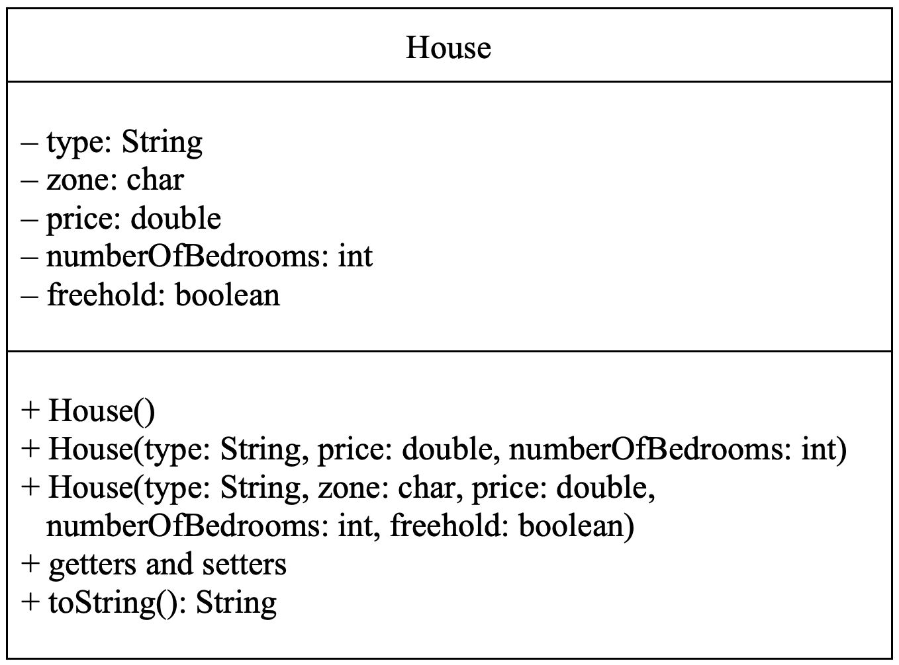
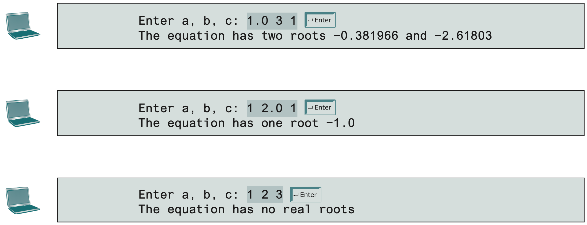

# Practical 07: Classes and Objects (Part 2)

Continuing off where we left off in the previous practical, we will now implement a form of encapsulation into our program.
In addition, you will begin using arrays or ArrayLists to contain a group of like objects together.

## Visiblity Modifiers

By default, a class, variable, or method can be access by any class in the same package.
However, this can cause misuse of an object.
This can be rectified by restricting acess to a class' members.

Member access control is acheived through the use of 4 **visibility modifiers**:

- default/package (`~`): By default, the class variable or method can be accessed by any class in the same package (folder).
- public (`+`): The class variable or method is visible to any class in any package.
- private (`-`): The class variable or method can be accessed only by the declaring class.
- protected (`#`): The class variable or method can be accessed by any class in the same package or its subclasses, even if the subclasses are in a different package.

### Visibility of Data Members

By default, data members should be `private`, as it is not good for them to be easily modifiable from another class.
This is because:

- data can be tampered
- it makes the class difficult to maintain and vulnerable to bugs

By making data members `private`, it disallows them from being accessed by an object through a direct reference outside the class.
In order to retrieve and modify these data fields, you will now need to provide accessor and mutator methods as interfaces to facilitate these operations.

- Accessor methods (or **get** methods) are methods used to read private properties.
  They always start with `get` followed by the name of the property (unless it's `boolean`, then you start with `is`).
- Mutator methods (or **set** methods) are methods used to modify private properties.
  They always start with `set` followed by the name of the property.

## Activity

Let's revisit each of the two classes we made in Practical 06's activity.

For both sets of classes,

1. Add the _public_ keyword in front of the class methods and constructors.
2. Set the data members _private_ and add their relevant accessor and mutator methods (i.e., `get` and `set` methods).
3. Modify your test class accordingly to cater for any errors.
   Did you find that some of the statements that worked before started not working this time?
4. Modify your class diagrams to indicate the visibility modifiers used for each class data member and method.

### Activity 1: The `Rectangle` Class

??? success "Rectangle Class (Solution)"

    ```java linenums="1" title="Rectangle.java"
    public class Rectangle {
    	private double width;
    	private double height;

    	public Rectangle() {
    		width = 1;
    		height = 1;
    	}

    	public Rectangle(double newWidth, double newHeight) {
    		width = newWidth;
    		height = newHeight;
    	}

    	// Accessor methods
    	public double getWidth() {
    		return width;
    	}

    	public double getHeight() {
    		return height;
    	}

    	// Mutator methods
    	public void setWidth(double width) {
    		this.width = width;
    	}

    	public void setHeight(double height) {
    		this.height = height;
    	}

    	// Other methods
    	public double getArea() {
    		return width * height;
    	}

    	public double getPerimeter() {
    		return 2 * (width + height);
    	}
    }
    ```

??? success "Test Class (Solution)"

    ```java linenums="1" title="TestRectangle.java"
    public class Rectangle {
        public static void main(String[] args) {
            Rectangle r1 = new Rectangle(4, 40);
            Rectangle r2 = new Rectangle(3.5, 35.9);

            System.out.println("RECTANGLE 1");
            // System.out.println("Width: " + r1.width);
            System.out.println("Width: " + r1.getWidth());
            // System.out.println("Width: " + r1.height);
            System.out.println("Height: " + r1.getHeight());
            System.out.println("Area: " + r1.getArea());
            System.out.println("Perimeter: " + r1.getPerimeter());

            System.out.println("\nRECTANGLE 2");
            // System.out.println("Width: " + r2.width);
            System.out.println("Width: " + r2.getWidth());
            // System.out.println("Width: " + r2.height);
            System.out.println("Height: " + r2.getHeight());
            System.out.println("Area: " + r2.getArea());
            System.out.println("Perimeter: " + r2.getPerimeter());
        }
    }
    ```

    **OUTPUT:**
    ```
    RECTANGLE 1
    Width: 4.0
    Height: 40.0
    Area: 160.0
    Perimeter: 88.0

    RECTANGLE 2
    Width: 3.5
    Height: 35.9
    Area: 125.64999999999999
    Perimeter: 78.8
    ```

## Tasks

### Task 1

Modify your `Planet` class (from Practical 06) by making its data members _private_ and adding the relevant `get` and `set` methods.
Modify your test class accordingly to test the `get` and `set` methods that you have written.

1.  Modify the driver program to include an array of `Planet` objects.
    Use the enhanced `for` loop to display the age corresponding to each `Planet` object stored in the array.

2.  Modify the `Planet` class by using the `this` keyword to refer to the data member(s) and constructor (if possible).

### Task 2

Create a class based on the following class diagram:

<!-- ```mermaid
classDiagram
	class House {
		- type: String
		- zone: char
		- price: double
		- numberOfBedrooms: int
		- freehold: boolean
		+ House()
		+ House(type: String, price: double, numberOfBedrooms: int)
		+ House(type: String, zone: char, price: double, numberOfBedrooms: int, freehold: boolean)
		+ getters and setters
		+ toString(): String
	}
``` -->



Notes:

- Initialize the value of `type` to “Apartment”, `zone` to ‘A’, `price` to 68000.00, `numberOfBedrooms` to 3 and `freehold` to `false` for no-arg constructor.
- Use the `toString()` method to print out all house details.

1. Create a driver program for the class you just created to test all the available constructors and methods.

   - Create three house objects.
   - Create an array to store the three house objects.

2. Modify the `House` class by using the `this` keyword to refer to the data member(s) and constructor (if possible).

### Task 3

Design a class named `QuadraticEquation` for a quadratic equation $ax^2 + bx + c = 0$.
The class contains:

- private data fields `a`, `b`, and `c` that represent three coefficients.
- a constructor with the arguments for `a`, `b`, and `c`.
- three getter methods for `a`, `b`, and `c`.
- a method named `getDiscriminant()` that returns the discriminant, which is $b^2 - 4ac$.
- the methods `getRoot1()` and `getRoot2()` for returning two roots of the equation

$$ r_1 = \frac{-b+\sqrt{b^2-4ac}}{2a} \text{ and } r_2 = \frac{-b-\sqrt{b^2-4ac}}{2a} $$

These methods are useful only if the discriminant is non-negative.
Let these methods return **0** if the discriminant is negative.

Draw the UML diagram for the class then implement the class.
Write a test program that prompts the user to enter values for $a$, $b$, and $c$ and displays the result based on the discriminant.
If the discriminant is positive, display the two roots.
If the discriminant is 0, display one root.
Otherwise, display "The equation has no roots."

Sample runs are as follows:



## Challenge Tasks

### Task 1

In an $n$-sided regular polygon, all sides have the same length and all angles have the same degree (i.e., the polygon is both equilateral and equiangular).
Design a class named `RegularPolygon` that contains:

- A private `int` data field named `n` that defines the number of sides in the polygon with default value **3**.
- A private `double` data field named `side` that stores the length of the side with default value **1**.
- A private `double` data field named `x` that defines the $x$-coordinate of the polygon's center with default value **0**.
- A private `double` data field named `y` that defines the $y$-coordinate of the polygon's center with default value **0**.
- A no-arg constructor that creates a regular polygon with default values.
- A constructor that creates a regular polygon with the specified number of sides and length of side, centered at **(0, 0)**.
- A constructor that creates a regular polygon with the specified number of sides, length of side, and $x$- and $y$-coordinates.
- The accessor and mutator methods for all data fields.
- The method `getPerimeter()` that returns the perimeter of the polygon.
- The method `getArea()` that returns the area of the polygon.
  The formula for computing the area of a regular polygon is

$$\text{Area}=\frac{n\times s^2}{4\times \tan{\frac{\pi}{n}}}$$

Draw the UML diagram for the class then implement the class.
Write a test program that creates three `RegularPolygon` objects, created using the no-arg constructor, using `RegularPolygon(6, 4)`, and using `RegularPolygon(10, 4, 5.6, 7.8)`.
For each object, display its perimeter and area.

### Task 2

Consider the following information:

| **Mickey Cake House**                                                                                               |
| ------------------------------------------------------------------------------------------------------------------- |
| Flavors:<br> 1. Chocolate Moist <br> 2. Strawberry <br> 3. Blueberry <br> 4. Cheesy Cake <br> 5. American Chocolate |
| Price List:<br> 1(kg) = RM 25.50<br>2(kg) = RM 50.00<br>3(kg) = RM 75.00                                            |

#### Part 1

Create a class named `Bakery` to represent a cake ordering system.
For each cake ordering system, you would need to store details about the _flavors_ (a string), _weight_ (a string) and _quantity_ ordered.

- Provide `get` and `set` methods for each data field.
  For each `set` method's parameter, **_use the same identifier as the corresponding data field_** (this would require the use of the `this` keyword to access the object's data field within the `set` method).

- Provide 2 constructors:

      - A three-parameter constructor.
      - A no-arg constructor which initializes the respective data fields to **"Chocolate Moist"**, **"1(kg)"** and **1** unit.
      	This constructor should invoke the three parameters constructor.

- Include a `toString()` method to print out all the cake ordering details.
- Create a driver program to test all the available constructors.

#### Part 2

Add the following method to your `Bakery` class from Part 1 to return the unit price:

```java
public double getPrice()
```

**NOTE:**
The unit price is dependent on the weight of the cake.
Remember to take class design into consideration and implement any necessary constructs to ensure the maintainability of your class.
Modify the driver program to test the `getPrice()` method.

#### Part 3

**Mickey Cake House** requires an application with the following sample dialog:

```
Enter how many types of cake you would like to order >> 2

Flavor
	1. Chocolate Moist
	2. Strawberry
	3. Blueberry
	4. Cheesy Cake
	5. American Chocolate

Price List
	(1)kg = RM25.50
	(2)kg = RM50.00
	(3)kg = RM75.00

Bakery Item 1
--------------
Enter your choice of cake flavor (1 - 5) >> 1
Enter the weight of cake (1 - 1kg, 2 - 2kg and 3 - 3kg) >> 2
Enter quantity ordered >> 2

Bakery Item 2
--------------
Enter your choice of cake flavor (1 - 5) >> 4
Enter the weight of cake (1 - 1kg, 2 - 2kg and 3 - 3kg) >> 1
Enter quantity ordered >> 3

Order Details:
----------------
No 	Cake Flavor       Weight    Unit Price (RM)   Quantity   Total Price (RM)
--  --------------   --------   ---------------   --------   ----------------
1   Chocolate Moist    2kg          50.00             2            100.00
2   Cheesy Cake        1kg          25.50             3             76.50
-----------------------------------------------------------------------------
                                                  Grand Total:     176.50
```

With reference to the above requirement, identify and make necessary additions/changes to your `Bakery` class and create the required application program.

Once again, remember to take object-oriented design issues into consideration and implement the necessary constructs to ensure the maintainability of your class.
