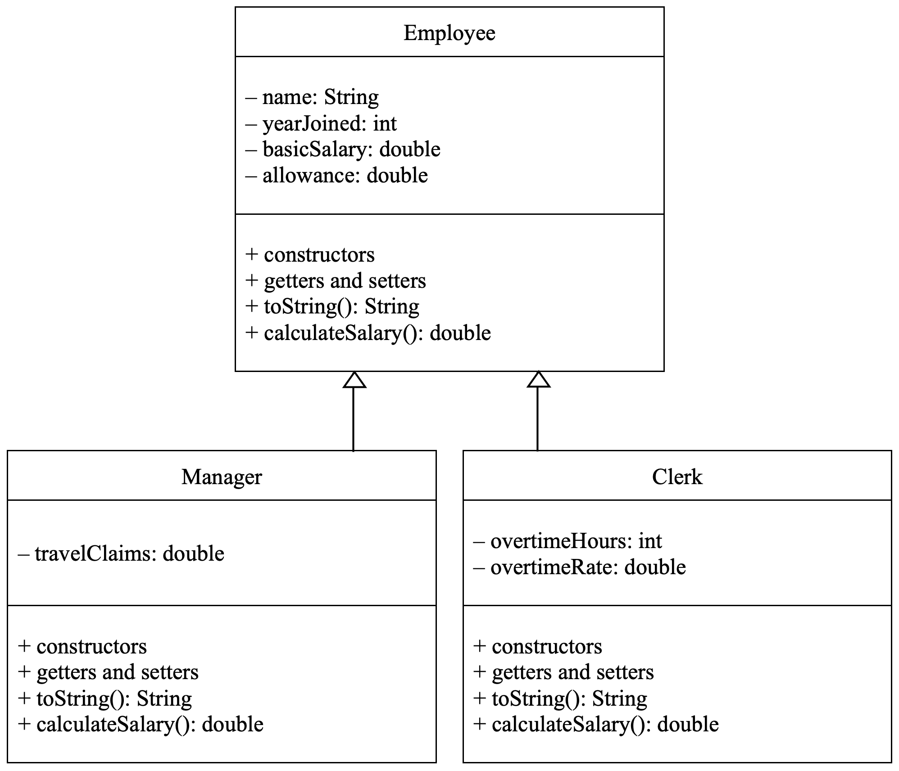

# Practical 09: Polymorphism

Polymorphism is another key concept in object-oriented programming.
It refers to the capability of objects to react differently to the same method.
Polymorphism can be implemented in the form of multiple methods having the same name.
Java code uses a late-binding technique to support polymorphism; the method to be invoked is decided at runtime.

## Activity: Overloading Methods vs. Overriding Methods

**Overloaded** methods are methods that have the same name, but different argument lists.
**Overriding**, on the other hand, occurs when a subclass method has the same name, same return type, and same argument list as the superclass method.

### Overloading Methods

One example of overloading methods that we have already covered during lecture when we first began going through classes and objects is through the use of multiple constructors.
Going back to the previous activity, let's look at the `FullTimeStaff` class.
Here, let's assume that if `baseSalary` isn't specified, it will be determined immediately by the `rank` entered.

We'll now create a separate constructor method that takes in the same parameters, except `baseSalary` is excluded from this list.

```java linenums="1" hl_lines="17-39" title="FullTimeStaff.java"
public class FullTimeStaff extends AcademicStaff {
	private int rank;
	private int contributionHours;
	private double baseSalary;

	// Constructors
	public FullTimeStaff(String fullName, String id, int qualificationLevel,
	                     int rank, int contributionHours, double baseSalary) {
		// calls the superclass' constructor
		super(fullName, id, qualificationLevel);

		this.rank = rank;
		this.contributionHours = contributionHours;
		this.baseSalary = baseSalary;
	}

	public FullTimeStaff(String fullName, String id, int qualificationLevel,
	                     int rank, int contributionHours) {
		super(fullName, id, qualificationLevel);
		this.rank = rank;
		this.contributionHours = contributionHours;

		switch(this.rank) {
			case 1:
				this.baseSalary = 2000;
				break;

			case 2:
				this.baseSalary = 2500;
				break;

			case 3:
				this.baseSalary = 3000;
				break;

			default:
				this.baseSalary = 0;
		}
	}

	/* ... */
}
```

We can do the same with the `PartTimeStaff` class, but with `hoursWorked` undefined.
In this case, `hoursWorked` to 0 if unspecified.

```java linenums="1" hl_lines="13-18" title="PartTimeStaff.java"
public class PartTimeStaff extends AcademicStaff {
	private double hourlyRate;
	private int hoursWorked;

	// Constructors
	public PartTimeStaff(String fullName, String id, int qualificationLevel,
	                     double hourlyRate, int hoursWorked) {
		super(fullName, id, qualificationLevel);
		this.hourlyRate = hourlyRate;
		this.hoursWorked = hoursWorked;
	}

	public PartTimeStaff(String fullName, String id, int qualificationLevel,
	                     double hourlyRate) {
		super(fullName, id, qualificationLevel);
		this.hourlyRate = hourlyRate;
		hoursWorked = 0;
	}

	/* ... */
}
```

Overloading methods isn't just restricted to constructors; this can be applied from a procedural programming standpoint.
Let's assume that this class has two methods that print out the area of a shape given two different sets of parameters.

```java linenums="1" title="Shape.java"
public class Shape {
	// Get area of quadrilateral
	public double getArea(double width, double height) {
		return width * height;
	}

	// Get area of circle
	public double getArea(double radius) {
		return Math.PI * radius * radius;
	}

	/* ... */
}
```

The key idea behind overloading methods is to have methods of the **same name, but different argument lists**.
Here, depending on whether one double value or two double values are entered, you get two different methods of calculating the area of the shape.
Overloading methods is also not restricted by the return type being used.
For example, one may create a `getArea()` method that returns an integer value based on yet another argument list.
The number of times a method is overloaded is not restricted as well, but ensure not to have ambiguous parameter lists like as follows:

```java linenums="1" title="Shape.java"
public class Shape {
	public double getArea(double width, double height) {
		/* ... */
	}

	public double getArea(double radius, int dimension) {
		/* ... */
	}

	/* ... */
}
```

Here, the compiler does not know which method to use when invoked with a parameter list where the second number can be interpreted as either an integer or double.

### Overriding Methods

Overriding methods involve having methods of the same name, return type, and argument list between superclass and subclass.

Going back to last week's activity again, we will now override the `toString()` and `calculateSalary()` methods of both subclasses.

#### FullTimeStaff.java

```java linenums="1" hl_lines="4-26" title="FullTimeStaff.java"
public class FullTimeStaff extends AcademicStaff {
	/* ... */

	public double calculateSalary() { return baseSalary + getBonus(); }

	public String toString() {
		String rankName = "";
		switch(rank) {
			case 1:
				rankName = "Lecturer";
				break;

			case 2:
				rankName = "Senior Lecturer";
				break;

			case 3:
				rankName = "Professor";
				break;

			default:
		}

		return super.toString()
				+ "\nStaff Rank: " + rankName;
	}
}
```

#### PartTimeStaff.java

```java linenums="1" hl_lines="4-9" title="PartTimeStaff.java"
public class PartTimeStaff extends AcademicStaff {
	/* ... */

	public double calculateSalary() { return hourlyRate * hoursWorked; }

	public String toString() {
		return super.toString()
				+ "\nStaff Rank: Part-Time Lecturer";
	}
}
```

In this example, we have already overriden `toString()` twice, once between the superclass and subclass we have just created, and the other via overriding from the `Object` class.
In Java, all classes are considered subclasses of the `Object` class, which in turn, is the superclass of just about any class that exists in Java and any class you create.
Java's `Object` class contains the `toString()` method by default, which prints out the memory address the object is taking up.
This is not particularly helpful to us as regular users who pay no regard to where about the object is specifically being stored in the computer's memory.

Making the following modifications to the main method in the driver class will render the following output:

```java linenums="1" title="Driver.java"
public class Driver {
	public static void main(String[] args) {
		FullTimeStaff staff1 = new FullTimeStaff("Horace Diaz", "ABC123", 3, 3, 10, 3000);
		System.out.println(staff1.toString());
		System.out.printf("(Staff1) Salary: $ %.2f", staff1.calculateSalary());

		System.out.println("\n");

		PartTimeStaff staff2 = new PartTimeStaff("Ivan Lam", "XYZ787", 2, 125, 20);
		System.out.println(staff2.toString());
		System.out.println("(Staff2) Hours worked: " + staff2.getHoursWorked());
		staff2.addHoursWorked(5);
		System.out.println("(Staff2) Hours worked: " + staff2.getHoursWorked());
		System.out.printf("(Staff2) Salary: $ %.2f", staff1.calculateSalary());
	}
}
```

Output:

    Full Name: Horace Diaz
    Staff ID: ABC123
    Qualification Type: Doctorate
    Staff Rank: Professor
    (Staff1) Salary: $ 4000.00

    Full Name: Ivan Lam
    Staff ID: XYZ787
    Qualification Type: Master
    Staff Rank: Part-Time Lecturer
    (Staff2) Hours worked: 20
    (Staff2) Hours worked: 25
    (Staff2) Salary: $ 3125.00

## Optional Activity: Subtype Polymorphism

Subtype polymorphism (also known as subtyping or inclusion polymorphism) is a type of polymorphism in which an object can change its class based on its base class (superclass).
Provided that the declaration is done using the object’s base class, the object can substitute its class with any classes that are subclasses of that superclass.

In our example, let's create yet another constructor in each of the subclasses to simulate a promotion/demotion act between full-time and part-time statuses.

### FullTimeStaff.java

```java linenums="1" hl_lines="41-44" title="FullTimeStaff.java"
public class FullTimeStaff extends AcademicStaff {
	private int rank;
	private int contributionHours;
	private double baseSalary;

	// Constructors
	public FullTimeStaff(String fullName, String id, int qualificationLevel,
	                     int rank, int contributionHours, double baseSalary) {
		// calls the superclass' constructor
		super(fullName, id, qualificationLevel);

		this.rank = rank;
		this.contributionHours = contributionHours;
		this.baseSalary = baseSalary;
	}

	public FullTimeStaff(String fullName, String id, int qualificationLevel,
	                     int rank, int contributionHours) {
		super(fullName, id, qualificationLevel);
		this.rank = rank;
		this.contributionHours = contributionHours;

		switch(this.rank) {
			case 1:
				this.baseSalary = 2000;
				break;

			case 2:
				this.baseSalary = 2500;
				break;

			case 3:
				this.baseSalary = 3000;
				break;

			default:
				this.baseSalary = 0;
		}
	}

	public FullTimeStaff(PartTimeStaff pt, int rank, int contributionHours) {
		this(pt.getFullName(), pt.getId(), pt.getQualificationLevel(), rank,
				contributionHours);
	}

	/* ... */
}
```

### PartTimeStaff.java

```java linenums="1" hl_lines="20-23" title="PartTimeStaff.java"
public class PartTimeStaff extends AcademicStaff {
	private double hourlyRate;
	private int hoursWorked;

	// Constructors
	public PartTimeStaff(String fullName, String id, int qualificationLevel,
	                     double hourlyRate, int hoursWorked) {
		super(fullName, id, qualificationLevel);
		this.hourlyRate = hourlyRate;
		this.hoursWorked = hoursWorked;
	}

	public PartTimeStaff(String fullName, String id, int qualificationLevel,
	                     double hourlyRate) {
		super(fullName, id, qualificationLevel);
		this.hourlyRate = hourlyRate;
		hoursWorked = 0;
	}

	public PartTimeStaff(FullTimeStaff ft, double hourlyRate) {
		this(ft.getFullName(), ft.getId(), ft.getQualificationLevel(),
				hourlyRate);
	}

	/* ... */
}
```

Try invoking these newly created constructors in your driver class to promote and demote the already created objects.

## Tasks

### Task 1

Consider the class diagram given below:

<figure markdown>

  <figcaption>Employee Superclass with Manager and Clerk Subclasses</figcaption>
</figure>

<!-- ```mermaid
classDiagram
class BankAccount{
    -name: String
    -yearJoined: int
		-basicSalary: double
		-allowance: double
		+BankAccount()
		+getName(): String
		+getYearJoined(): int
		+getBasicSalary(): double
		+getAllowance(): double
		-setName(name: String)
		-setYearJoined(yearJoined: int)
		-setBasicSalary(basicSalary: double)
		-setAllowance(allowance: double)
    +toString(): String
		+calculateSalary(): double
}

class Manager {
	-travelClaims: double
}

BankAccount <|-- Manager
``` -->

1.  Implement all the classes as according to the given hierarchy.

2.  Write a test program that creates an array named `empArray` that stores an object of an Employee, a Manager, and a Clerk.<br>
    In your program, include a method called `printElements()` that takes an array as a parameter and prints the type of employee, the object's data field values (by invoking the `toString()` method) and the monthly salary.

3.  Override the Object class' `equals()` method in Employee, Manager, and clerk classes.
    For each class, assume that two objects are considered equal if they have the **_same_** name.
    Test the `equals()` method on all derived types of Employee.

### Task 2

A bank offers its customers the following account types:

- The savings account earns interest that compounds monthly (i.e., the interest is calculated based on the balance on the last day of the month).
- The checking account has no interest, but the customer is given a small number of free transactions per month and is charged a nominal fee for each additional transaction.

1. Create a superclass `Account` that has the properties account number, balance, and date created, as well as methods for deposit and withdrawal.
   Create two subclasses for saving and checking accounts.

2. Write a test program that creates objects of the classes `Account`, `SavingsAccount`, and `CheckingAccount`.

Draw the UML diagram for the classes and implement them.
Write a test program that creates objects of `Account`, `SavingsAccount`, and `CheckingAccount` and invokes their `toString()` methods.
